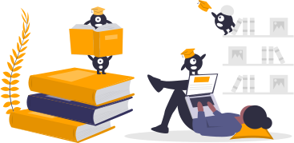

# DataLad Tutorials

A registry of tutorials, workshop material, videos and other educational resources to help you learn more about DataLad.

## Content

1. :link: [Quick links](#links)
2. :rocket: [Entry-level](#entry)
3. :nerd_face: [In-depth](#depth)
4. :microphone: [Talks](#talks)

## Quick links

- :book: [The DataLad Handbook](http://handbook.datalad.org/en/latest/)
- :tv: [The DataLad Youtube channel](https://www.youtube.com/c/DataLad)
- :raising_hand: [Technical forum](https://neurostars.org/search?q=datalad%20category%3A1)
- :speech_balloon: [Community chat](https://matrix.to/#/#datalad:matrix.org)

 

# :rocket: Entry-level

### Introductory walk-throughs

| Title | Content | Binder |
| :--- | :---: | :---: |
| An introduction to DataLad at the MPI Berlin | [:computer:](http://handbook.datalad.org/en/latest/code_from_chapters/DLBasicsMPI.html) | - |
| DataLad tutorial at the MPI Leipzig | [:computer:](http://handbook.datalad.org/en/latest/code_from_chapters/MPI_code.html#datalad-tutorial-at-the-mpi-leipzig) | - |
| An introduction to DataLad for the ABCD ReproNim course week 8b | [:computer:](http://handbook.datalad.org/en/latest/code_from_chapters/ABCD.html) | - |
| An introduction to DataLad for Yale | [:computer:](http://handbook.datalad.org/en/latest/code_from_chapters/yale.html) | - | 
| Exploring the StudyForrest dataset with DataLad | [:computer:](https://github.com/psychoinformatics-de/studyforrest-data-binder/blob/main/exploring_studyforrest_with_datalad.ipynb) |  | 
| A short guide to accessing OpenNeuro datasets via DataLad | [:computer:](http://handbook.datalad.org/en/latest/usecases/openneuro.html) |  | 

### Workshops

| Title | Presenter | Video | Content | Binder |
| :--- | :---: | :---: | :---: | :---: |
| OHBM Brainhack TrainTrack: DataLad | Adina Wagner | [:movie_camera:](https://www.youtube.com/watch?v=sDP1jhRkKRo) | [:computer:](http://handbook.datalad.org/en/latest/code_from_chapters/OHBM.html) |  |

 

# :nerd_face: In-depth

| Title | Presenter | Video | Content |
| :--- | :---: | :---: | :---: |
| A hands-on introduction to DataLad | Adina Wagner | [:movie_camera:](https://www.youtube.com/watch?v=_I3JFhJJtW0) | - |
| An introduction to DataLad with a focus on machine learning | Adina Wagner | [:movie_camera:](https://www.youtube.com/watch?v=_I3JFhJJtW0) | [:computer:](http://handbook.datalad.org/en/latest/code_from_chapters/usecase_ml_code.html)
| Workshop on Research Data Management with DataLad | Adina Wagner & Lennart Wittkuhn | [:movie_camera: &nbsp; session 1](https://www.youtube.com/watch?v=fL3DWzSWFL8&list=PLEQHbPfpVqU5sSVrlwxkP0vpoOpgogg5j&index=1) | - |
| Workshop on Research Data Management with DataLad | Adina Wagner & Lennart Wittkuhn | [:movie_camera: &nbsp; session 2](https://www.youtube.com/watch?v=GrOfE8jv12s&list=PLEQHbPfpVqU5sSVrlwxkP0vpoOpgogg5j&index=2) | - |
| Workshop on Research Data Management with DataLad | Adina Wagner & Lennart Wittkuhn | [:movie_camera: &nbsp; session 3](https://www.youtube.com/watch?v=lO4yfl30_uc&list=PLEQHbPfpVqU5sSVrlwxkP0vpoOpgogg5j&index=3) | - |
| Workshop on Research Data Management with DataLad | Adina Wagner & Lennart Wittkuhn | [:movie_camera: &nbsp; session 4](https://www.youtube.com/watch?v=3ePgH-kK8h8&list=PLEQHbPfpVqU5sSVrlwxkP0vpoOpgogg5j&index=4) | - |

 

# :microphone: Talks

| Title | Presenter | Video |
| :--- | :--- | :---: |
| DataLad - Decentralized Distribution and Sharing of Scientific Datasets | Yaroslav Halchenko | [:movie_camera:](https://www.youtube.com/watch?v=sDP1jhRkKRo) |
| DataLad vs Git/Git-annex for modular data management | Michael Hanke | [:movie_camera:](https://www.youtube.com/watch?v=Yrg6DgOcbPE) |
| How to introduce data management technology without sinking the ship? | Michael Hanke | [:movie_camera:](https://www.youtube.com/watch?v=uH75kYgwLH4) |
| Perpetual decentralized management of digital objects for collaborative open science | Michael Hanke | [:movie_camera:](https://www.youtube.com/watch?v=SJ64rSMD9PU) |
| DataLad - Decentralized Management of Digital Objects for Open Science | Adina Wagner | [:movie_camera:](https://www.youtube.com/watch?v=pIGFS8XDjco) |
| Data versioning and transformation with DataLad | Adina Wagner | [:movie_camera:](https://www.youtube.com/watch?v=wimd1uhIJ8g) |

